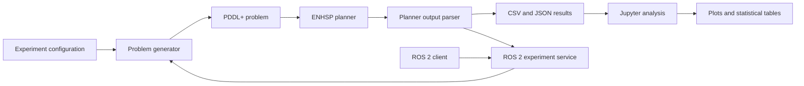

<div align="center">

# 🚀 Planetary Rover Planning Experiments

### PDDL+ · ENHSP · ROS 2 · Jupyter

An experimental framework for studying how **memory limits**, **mission size**, and **time-dependent data corruption** affect planetary-rover planning.


</div>

---

## 🌍 Project idea

A planetary rover must travel between scientific sites, collect datasets, encode them, store them in limited onboard memory, and return to base before the data becomes corrupted.

The project investigates:

> **How do onboard memory capacity, dataset count, and time-dependent data degradation affect mission feasibility, plan efficiency, and planner runtime?**

This repository extends an earlier **AI for Robotics II** assignment. The original assignment contained a PDDL+ rover model; this project transforms it into a complete experimental framework with automated generation, batch execution, statistical analysis, and ROS 2 integration.

---

## ✨ What was added beyond the AI2 assignment

| AI2 assignment | Experimental study |
|---|---|
| One manually tested rover model | Automatically generated rover missions |
| Instantaneous movement | Timed movement using action, process, and event |
| Individual ENHSP runs | Reproducible batch experiments |
| Manual plan inspection | Automatic output parsing and CSV generation |
| No statistical study | Jupyter analysis, plots, and statistical tests |
| No ROS interface | ROS 2 service and client |

Timed movement is represented as:

```text
start-move action
        ↓
rover-travel process
        ↓
arrive event
```

While the rover travels, **encoding and corruption continue to evolve**.

---

## 📊 Experiment at a glance

| Factor | Values |
|---|---|
| Dataset count | 3, 5, 7 |
| Memory level | Low, medium, high |
| Corruption level | Low, medium, high |
| Random seeds | 0–4 |
| Standard timeout | 60 seconds |
| Total instances | **135** |

```text
3 dataset counts
× 3 memory levels
× 3 corruption levels
× 5 seeds
= 135 experiments
```

### Final classification

| Outcome | 60-second run | After selective 180-second reruns |
|---|---:|---:|
| Solved | 66 | 66 |
| Unsolvable | 62 | 67 |
| Timeout | 7 | 2 |

A timeout is kept separate from an unsolvable result because it does not prove that no valid plan exists.

---

## 📈 Main results

<p align="center">
  
  
</p>

<p align="center">
  
  
</p>

### Key observations

- **Corruption severity strongly affects feasibility.**
- **Memory capacity mainly affects efficiency**, reducing return trips, travel time, and makespan.
- **Larger missions are computationally harder**, especially seven-dataset medium-corruption cases.
- Some unsolvable boundary cases require substantially more planner time than solved instances.

More figures are available in [`experiments/plots`](experiments/plots).

---

## 🧠 System architecture



The same generator and planner runner are reused by both the batch experiment and the ROS 2 service.

---

## 🗂️ Repository map

| Path | Purpose |
|---|---|
| `planning_models/pddl_plus/` | Original and timed PDDL+ domains |
| `experiments/config/` | Experiment factor configuration |
| `experiments/scripts/` | Generator, planner runner, and batch runner |
| `experiments/results/` | CSV, JSON, and analysis tables |
| `experiments/plots/` | Generated figures |
| `notebooks/` | Jupyter analysis and ROS demonstration |
| `ros2_ws/src/` | ROS 2 interface, service, and client |
| `paper/` | IEEE-style report files |

---

## 🔑 Important files

### PDDL+ domains

- `planning_models/pddl_plus/domain-memory-rover-plus.pddl`  
  Original domain with instantaneous movement.

- `planning_models/pddl_plus/domain-memory-rover-experimental.pddl`  
  Experimental domain with timed movement, continuous travel progress, encoding, corruption, and automatic arrival/data-loss events.

### Experiment scripts

- `experiments/scripts/problem_generator.py`  
  Generates reproducible mission instances and JSON metadata.

- `experiments/scripts/planner_runner.py`  
  Runs ENHSP, applies a timeout, saves raw output, and extracts structured metrics.

- `experiments/scripts/batch_experiment.py`  
  Executes the full factorial experiment and writes one CSV row per instance.

### Analysis

- `notebooks/timed_rover_experiment_analysis.ipynb`  
  Validates the dataset, creates figures, exports tables, performs exploratory statistical tests, and demonstrates ROS 2 interaction.

### ROS 2

- `ros2_ws/src/rover_experiment_interfaces/srv/RunExperiment.srv`  
  Defines the custom experiment request and response.

- `ros2_ws/src/rover_experiment_ros/rover_experiment_ros/experiment_service.py`  
  Receives experiment requests, generates the problem, runs ENHSP, and returns the result.

- `ros2_ws/src/rover_experiment_ros/rover_experiment_ros/experiment_client.py`  
  Sends an experiment request and prints the response as JSON.

---

## ⚡ Quick start

### Requirements

- Ubuntu 24.04 or WSL
- Python 3.12
- Java
- ENHSP
- ROS 2 Jazzy
- JupyterLab

<details>
<summary><strong>1. Create the Python environment</strong></summary>

```bash
python3 -m venv .venv
source .venv/bin/activate

python -m pip install --upgrade pip
python -m pip install \
  jupyterlab \
  pandas \
  numpy \
  matplotlib \
  scipy \
  nbformat \
  setuptools
```

</details>

<details>
<summary><strong>2. Generate one timed mission</strong></summary>

```bash
python3 experiments/scripts/problem_generator.py \
  --model timed \
  --datasets 3 \
  --memory low \
  --corruption low \
  --seed 0
```

Generated PDDL and metadata files are written to:

```text
experiments/generated_problems/
```

</details>

<details>
<summary><strong>3. Run ENHSP on one mission</strong></summary>

```bash
python3 experiments/scripts/planner_runner.py \
  --domain planning_models/pddl_plus/domain-memory-rover-experimental.pddl \
  --problem experiments/generated_problems/rover-timed-n3-mem-low-corr-low-seed-0.pddl \
  --output experiments/raw_outputs/example_run.txt \
  --timeout 60
```

The runner returns structured JSON containing:

```text
status
solved
wall_runtime_seconds
plan_makespan
action_count
move_actions
collect_actions
offload_actions
```

</details>

<details>
<summary><strong>4. Run the complete 135-instance experiment</strong></summary>

```bash
python3 experiments/scripts/batch_experiment.py \
  --model timed \
  --runs-per-condition 5 \
  --seed-start 0 \
  --timeout 60 \
  --results experiments/results/timed_pilot_5_seeds.csv
```

</details>

<details>
<summary><strong>5. Run the Jupyter analysis</strong></summary>

```bash
source .venv/bin/activate
python -m jupyter lab
```

Open:

```text
notebooks/timed_rover_experiment_analysis.ipynb
```

Then select:

```text
Run → Restart Kernel and Run All Cells
```

Figures are saved to `experiments/plots/` and tables to `experiments/results/tables/`.

</details>

---

## 🤖 ROS 2 integration

### Build the workspace

```bash
cd ros2_ws
source /opt/ros/jazzy/setup.bash
colcon build --symlink-install
source install/setup.bash
```

### Start the experiment service

From the repository root:

```bash
source /opt/ros/jazzy/setup.bash
source ros2_ws/install/setup.bash

export ROVER_PROJECT_ROOT="$PWD"

ros2 run rover_experiment_ros experiment_service
```

### Send a request

In a second terminal:

```bash
source /opt/ros/jazzy/setup.bash
source ros2_ws/install/setup.bash

ros2 run rover_experiment_ros experiment_client \
  --datasets 3 \
  --memory low \
  --corruption low \
  --seed 0 \
  --timeout 60
```

Example result:

```json
{
  "instance_id": "rover-timed-n3-mem-low-corr-low-seed-0",
  "status": "solved",
  "solved": true,
  "wall_runtime_seconds": 0.811075,
  "plan_makespan": 34.0,
  "action_count": 18,
  "move_actions": 12,
  "error_message": ""
}
```

---

## 🔬 Metrics

| Metric | Meaning |
|---|---|
| `status` | Solved, unsolvable, timeout, or error |
| `wall_runtime_seconds` | Real planner execution time |
| `plan_makespan` | Simulated mission completion time |
| `action_count` | Planner-selected actions |
| `move_actions` | Number of rover movements |
| `estimated_travel_time` | Movement count × edge duration |
| `stationary_time` | Makespan minus estimated travel time |

ENHSP's reported plan length is kept separately because it may include automatic events and temporal happenings, not only planner-selected actions.

---

## ♻️ Reproducibility

Mission generation is deterministic for the same:

```text
dataset count
memory level
corruption level
seed
```

The original 60-second results are preserved for fair runtime comparison. Extended 180-second reruns are used only to improve the classification of the original timeout cases.

---

## ⚠️ Limitations

- Missions and datasets are synthetic.
- Corruption is deterministic rather than probabilistic.
- The map is a linear chain.
- Every map edge has the same duration.
- Only one rover and one planner are evaluated.
- Five seeds are used per condition.
- Runtime includes Java startup overhead.
- Two instances remain unresolved after 180 seconds.
- The project does not control a physical rover.

---

## 🛠️ Possible extensions

- probabilistic corruption;
- multiple rovers;
- non-linear maps;
- terrain-dependent travel time;
- communication windows;
- planner comparison;
- Gazebo simulation;
- larger experiment campaigns.

---

## 👤 Author

**Endri Gjinaj**  
Master's Degree in Robotics Engineering  
University of Genoa
