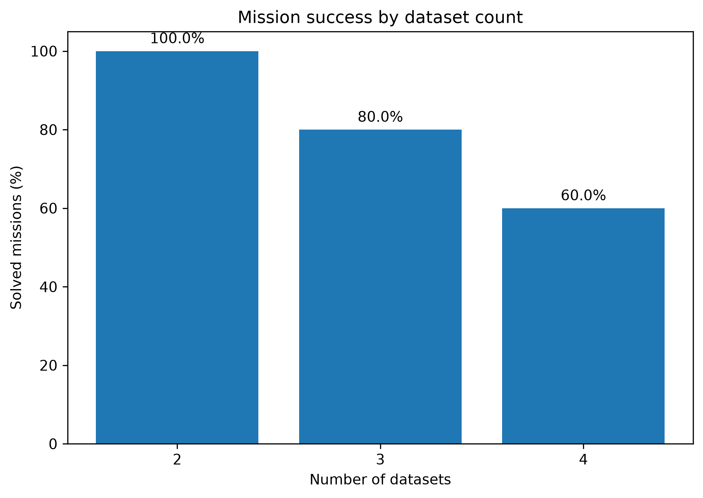
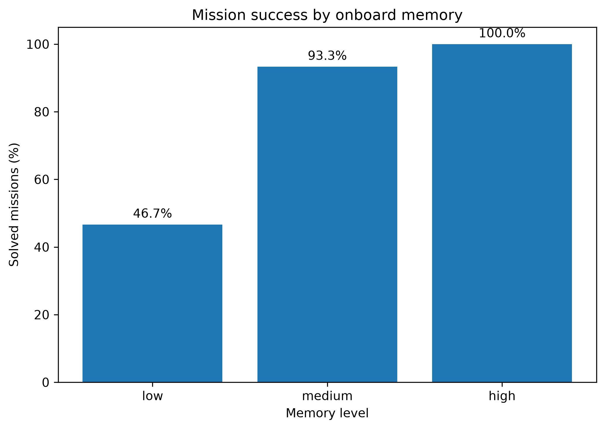
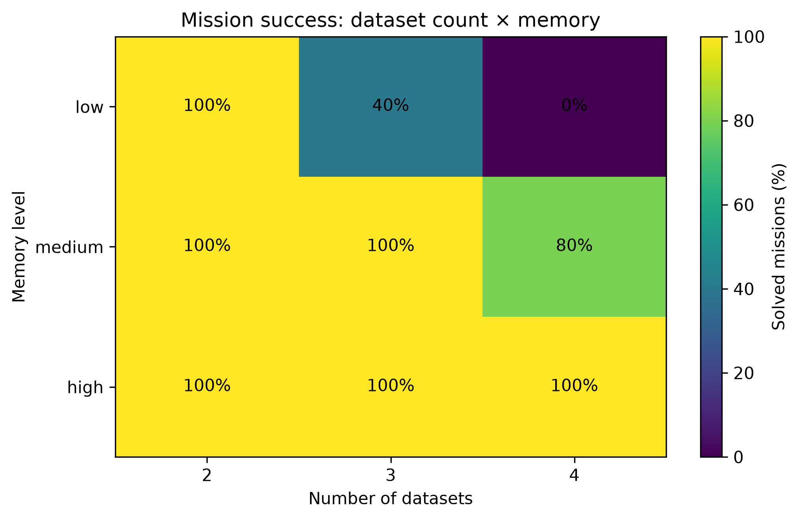
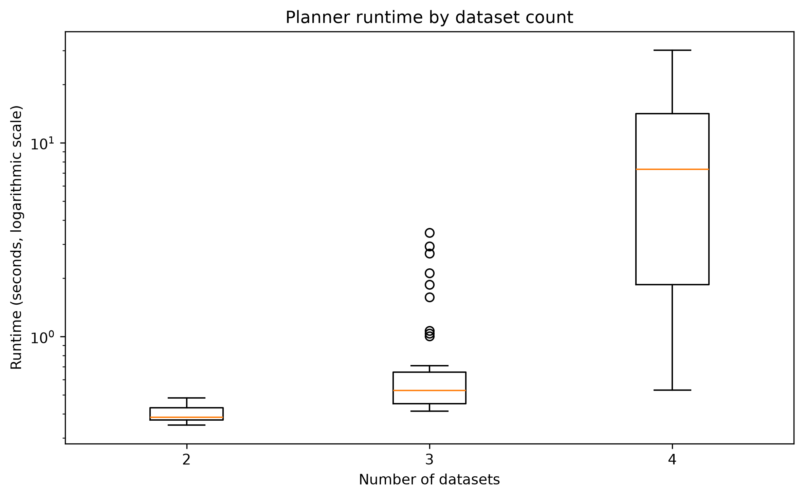
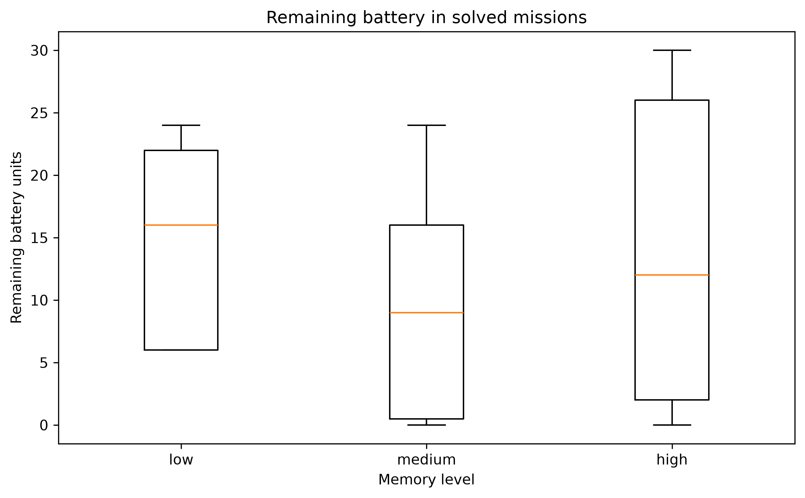
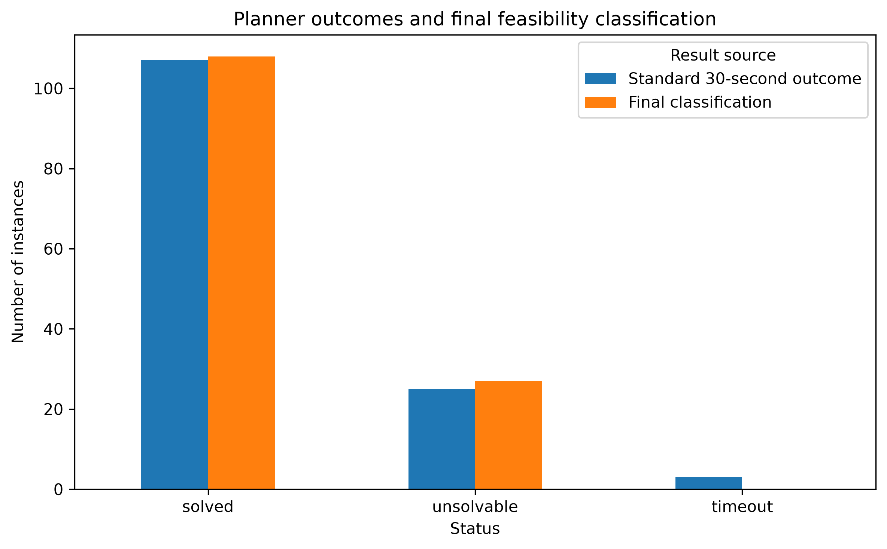
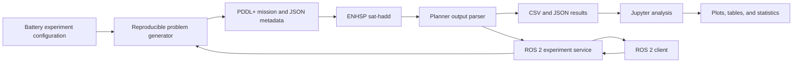

<div align="center">

# Battery-Constrained Planetary Rover Planning

### PDDL+ · ENHSP · ROS 2 Jazzy · Python · Jupyter

A reproducible experimental framework for studying how **onboard memory**,  
**mission size**, and **time-dependent data corruption** affect autonomous rover planning under a finite battery budget.


</div>

---

## Project overview

A planetary rover must travel across terrain, collect scientific datasets, encode them, keep them in limited onboard memory, return to base, and offload them before they are lost through time-dependent corruption.

The final model adds a finite battery and terrain-dependent movement costs. A valid plan must therefore satisfy three interacting requirements:

```text
data must be encoded and offloaded before corruption
+
stored data must fit in onboard memory
+
the rover must retain enough energy for every movement
```

### Research question

> **How do onboard memory capacity, the number of scientific datasets, and time-dependent data degradation affect mission feasibility, generated-plan efficiency, and computational difficulty in battery-constrained planetary-rover planning with PDDL+?**

---

## From course assignment to experimental study

| Earlier AI for Robotics II model | Final experimental framework |
|---|---|
| One manually tested PDDL+ rover problem | Reproducible problem generation across controlled conditions |
| Instantaneous movement | Timed movement using an action, continuous process, and arrival event |
| Constant travel properties | Seeded terrain with different travel times and energy costs |
| Memory and corruption only | Memory, corruption, timed travel, terrain, and finite battery |
| Individual planner runs | Automated factorial batch execution |
| Manual output inspection | Structured JSON/CSV parsing and validation |
| No statistical evaluation | Executed Jupyter notebook, figures, tables, tests, and effect sizes |
| No external interface | ROS 2 service/client and notebook demonstration |

Timed movement is represented as:

```text
start-move action
        ↓
rover-travel process
        ↓
arrive event
```

Encoding and corruption continue to evolve while the rover is travelling.

---

## Final rover model

The final PDDL+ model includes:

- timed bidirectional movement;
- terrain-dependent travel duration;
- terrain-dependent movement-energy cost;
- a fixed battery capacity of **40 energy units**;
- numeric onboard memory;
- variable dataset sizes;
- continuous encoding progress;
- continuous corruption growth;
- automatic encoding-completion, arrival, and data-loss events;
- collection and offloading actions;
- a total-time minimization metric.

Battery is consumed by movement. Time affects encoding and corruption, while extra returns to base increase both travel and energy use.

---

## Experimental design

The model was calibrated using seeds `0–4`, frozen, and then evaluated on unseen seeds `10–14`.

| Factor | Final values |
|---|---|
| Dataset count | 2, 3, 4 |
| Memory level | Low, medium, high |
| Memory ratios | 0.45, 0.70, 1.00 |
| Corruption level | Low, medium, high |
| Final seeds | 10, 11, 12, 13, 14 |
| Battery capacity | 40 energy units |
| Terrain profiles | Easy, moderate, rocky, steep |
| Planner | ENHSP `sat-hadd` |
| Standard timeout | 30 seconds |
| Selective classification timeout | 120 seconds |
| Final instances | **135** |

```text
3 dataset counts
× 3 memory levels
× 3 corruption levels
× 5 unseen seeds
= 135 final experiments
```

### Timeout policy

The original 30-second outcome is retained for computational-performance analysis. Only standard timeout cases are rerun with a 120-second limit to obtain a final feasibility classification.

| Outcome | Standard 30-second run | Final classification |
|---|---:|---:|
| Solved | 107 | 108 |
| Unsolvable | 25 | 27 |
| Timeout | 3 | 0 |

A timeout is never treated as proof that a mission is unsolvable.

---

## Final results

<p align="center">
  
  
</p>

<p align="center">
  
  
</p>

<p align="center">
  
  
</p>

### Main findings

#### Mission size strongly reduced feasibility

| Datasets | Solved | Unsolvable | Success |
|---:|---:|---:|---:|
| 2 | 45 | 0 | **100%** |
| 3 | 36 | 9 | **80%** |
| 4 | 27 | 18 | **60%** |

Mean standard planner runtime increased from approximately **0.40 s** for two datasets to **9.36 s** for four datasets.

#### Memory was the strongest feasibility factor

| Memory | Solved | Unsolvable | Success |
|---|---:|---:|---:|
| Low | 21 | 24 | **46.7%** |
| Medium | 42 | 3 | **93.3%** |
| High | 45 | 0 | **100%** |

The interaction is especially clear for larger missions:

| Mission size | Low memory | Medium memory | High memory |
|---:|---:|---:|---:|
| 2 datasets | 100% | 100% | 100% |
| 3 datasets | 40% | 100% | 100% |
| 4 datasets | 0% | 80% | 100% |

#### Corruption severity changed search behaviour more than feasibility

Each corruption level produced an overall **80% success rate** in the final unseen experiment. However, mean standard planner runtime decreased from approximately **6.25 s** under low corruption to **1.01 s** under high corruption.

This indicates that tighter corruption constraints can reduce temporal search freedom, even though they do not necessarily change the final number of feasible missions in this experiment.

#### Statistical evidence

Exploratory tests found:

- a significant association between dataset count and feasibility, with Cramér's V ≈ **0.41**;
- a significant and stronger association between memory level and feasibility, with Cramér's V ≈ **0.59**;
- no observed association between corruption level and feasibility in the final sample;
- a strong dataset-count effect on standard planner runtime;
- large matched-memory effects on movements, energy use, and makespan for missions solved under all three memory levels.

Full tables are available in:

```text
experiments/results/tables/battery_final/
```

---

## System architecture



The batch system and ROS 2 service reuse the same generator and planner runner rather than duplicating planning logic.

---

## Repository map

| Path | Purpose |
|---|---|
| `planning_models/pddl_plus/` | Original, timed, and battery-constrained PDDL+ domains |
| `experiments/config/` | Experiment configurations |
| `experiments/scripts/` | Problem generator, ENHSP runner, and batch runner |
| `experiments/results/` | Standard, classified, and extended results |
| `experiments/results/tables/battery_final/` | Final exported analysis tables |
| `experiments/plots/battery_final/` | Final 300-dpi figures |
| `notebooks/` | Executed analysis notebooks |
| `ros2_ws/src/rover_experiment_interfaces/` | Custom ROS 2 service definition |
| `ros2_ws/src/rover_experiment_ros/` | ROS 2 experiment service and client |

---

## Important files

### Final PDDL+ model

```text
planning_models/pddl_plus/domain-memory-rover-battery.pddl
```

### Frozen final configuration

```text
experiments/config/experiment_config_battery.json
```

### Experiment pipeline

```text
experiments/scripts/problem_generator.py
experiments/scripts/planner_runner.py
experiments/scripts/batch_experiment.py
```

### Final results

```text
experiments/results/battery_final_unseen.csv
experiments/results/battery_final_unseen_classified.csv
experiments/results/battery_final_unseen_extended.csv
```

### Final executed notebook

```text
notebooks/battery_rover_experiment_analysis.ipynb
```

### ROS 2 integration

```text
ros2_ws/src/rover_experiment_interfaces/srv/RunExperiment.srv
ros2_ws/src/rover_experiment_ros/rover_experiment_ros/experiment_service.py
ros2_ws/src/rover_experiment_ros/rover_experiment_ros/experiment_client.py
```

---

## Quick start

### Requirements

- Ubuntu 24.04 or WSL
- Python 3.12
- Java
- ENHSP
- ROS 2 Jazzy
- JupyterLab

<details>
<summary><strong>1. Create the Python environment</strong></summary>

```bash
python3 -m venv .venv
source .venv/bin/activate

python3 -m pip install --upgrade pip
python3 -m pip install \
  jupyterlab \
  pandas \
  numpy \
  matplotlib \
  scipy \
  nbformat \
  setuptools
```

</details>

<details>
<summary><strong>2. Generate one battery-constrained mission</strong></summary>

```bash
python3 experiments/scripts/problem_generator.py \
  --model battery \
  --datasets 3 \
  --memory medium \
  --corruption medium \
  --seed 10 \
  --config experiments/config/experiment_config_battery.json \
  --output-dir experiments/generated_problems/example_battery_run
```

The generator creates a PDDL+ problem and a matching JSON metadata file.

</details>

<details>
<summary><strong>3. Run ENHSP on the generated mission</strong></summary>

```bash
python3 experiments/scripts/planner_runner.py \
  --domain planning_models/pddl_plus/domain-memory-rover-battery.pddl \
  --problem experiments/generated_problems/example_battery_run/rover-battery-n3-mem-medium-corr-medium-seed-10.pddl \
  --output experiments/raw_outputs/example_battery_run.txt \
  --planner sat-hadd \
  --timeout 30
```

The runner returns structured JSON containing the planning status, runtime, makespan, explicit action counts, movements, collections, offloads, and parsed temporal information.

</details>

<details>
<summary><strong>4. Reproduce the final 135-instance experiment</strong></summary>

```bash
python3 experiments/scripts/batch_experiment.py \
  --model battery \
  --config experiments/config/experiment_config_battery.json \
  --runs-per-condition 5 \
  --seed-start 10 \
  --planner sat-hadd \
  --timeout 30 \
  --generated-dir experiments/generated_problems/battery_final_unseen \
  --raw-output-dir experiments/raw_outputs/battery_final_unseen \
  --results experiments/results/battery_final_unseen.csv
```

</details>

<details>
<summary><strong>5. Run the final Jupyter analysis</strong></summary>

```bash
source .venv/bin/activate
python3 -m jupyter lab
```

Open:

```text
notebooks/battery_rover_experiment_analysis.ipynb
```

Then select:

```text
Kernel → Restart Kernel and Run All Cells
```

The notebook validates the final dataset, produces figures and tables, performs exploratory statistical tests, and runs a ROS 2 battery demonstration when the service is active.

</details>

---

## 🤖 ROS 2 integration

### Build the workspace

```bash
cd ros2_ws
source /opt/ros/jazzy/setup.bash
colcon build --symlink-install
source install/setup.bash
cd ..
```

### Start the service

From the repository root:

```bash
source /opt/ros/jazzy/setup.bash
source ros2_ws/install/setup.bash
export ROVER_PROJECT_ROOT="$PWD"

ros2 run rover_experiment_ros experiment_service
```

### Send a request

In a second terminal:

```bash
cd /path/to/planetary-rover-experimental-study

source /opt/ros/jazzy/setup.bash
source ros2_ws/install/setup.bash

ros2 run rover_experiment_ros experiment_client \
  --datasets 3 \
  --memory medium \
  --corruption medium \
  --seed 0 \
  --timeout 30
```

Example response:

```json
{
  "instance_id": "rover-battery-n3-mem-medium-corr-medium-seed-0",
  "status": "solved",
  "solved": true,
  "wall_runtime_seconds": 0.476625,
  "plan_makespan": 28.0,
  "action_count": 16,
  "move_actions": 10,
  "battery_capacity": 40.0,
  "energy_used": 26.0,
  "battery_remaining": 14.0,
  "battery_feasible": true,
  "error_message": ""
}
```

---

## 📏 Recorded metrics

| Metric | Meaning |
|---|---|
| `status` | Solved, unsolvable, timeout, error, or unknown |
| `classification_status` | Final solved/unsolvable classification after selective reruns |
| `wall_runtime_seconds` | Real ENHSP execution time under the standard budget |
| `plan_makespan` | Simulated completion time of a generated plan |
| `action_count` | Explicit planner-selected actions |
| `move_actions` | Explicit rover movement actions |
| `travel_time_in_plan` | Sum of terrain-specific travel durations |
| `energy_used` | Sum of movement-energy costs |
| `battery_remaining` | Battery capacity minus generated-plan energy use |
| `battery_utilization_ratio` | Fraction of the 40-unit battery consumed |
| `memory_utilization_ratio` | Total dataset volume divided by memory capacity |

ENHSP's reported plan length is stored separately because it may include temporal happenings and automatic events, not only explicit planner-selected actions.

---

## Reproducibility

Mission generation is deterministic for the same:

```text
dataset count
memory level
corruption level
seed
configuration
```

Independent seeded random-number generators preserve fair comparisons:

- dataset sizes and encoding times depend on the mission seed;
- terrain depends on the same seed but a separate deterministic stream;
- corruption margins depend on the condition and seed;
- changing only memory or corruption does not silently regenerate unrelated mission properties.

The calibration seeds `0–4` are separated from final evaluation seeds `10–14`. The frozen model is tagged:

```text
battery-model-frozen-v1
```

---

## Limitations

- Missions, terrain, and datasets are synthetic.
- The map is a bidirectional linear chain.
- Corruption is deterministic rather than probabilistic.
- Battery is consumed by movement only.
- A single rover and a single ENHSP configuration are evaluated.
- The planner is satisficing, so generated-plan metrics are not guaranteed global optima.
- Five final seeds are used per experimental condition.
- Runtime includes Java and planner startup overhead.
- The controlled factorial experiment is limited to 2–4 datasets; larger PDDL+ instances showed reduced planner coverage during calibration.
- The project does not control a physical rover.

---

## Possible extensions

- probabilistic degradation;
- energy use for sensing, encoding, and communication;
- nonlinear maps and alternative paths;
- solar charging and communication windows;
- multiple rovers;
- planner and heuristic comparison;
- larger experiment campaigns;
- Gazebo or physical-rover integration.

---

## Author

**Endri Gjinaj**  
Master's Degree in Robotics Engineering  
University of Genoa
