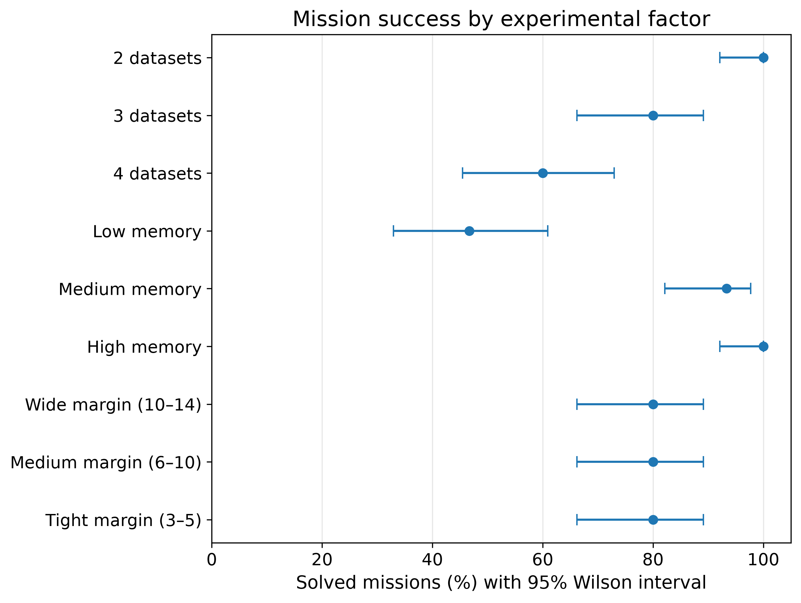
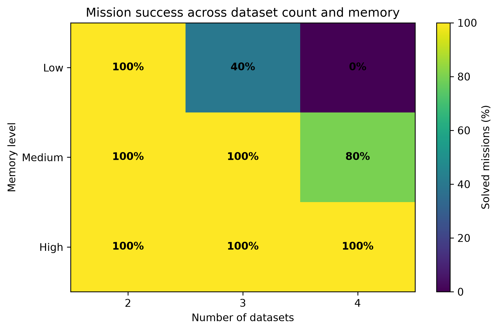
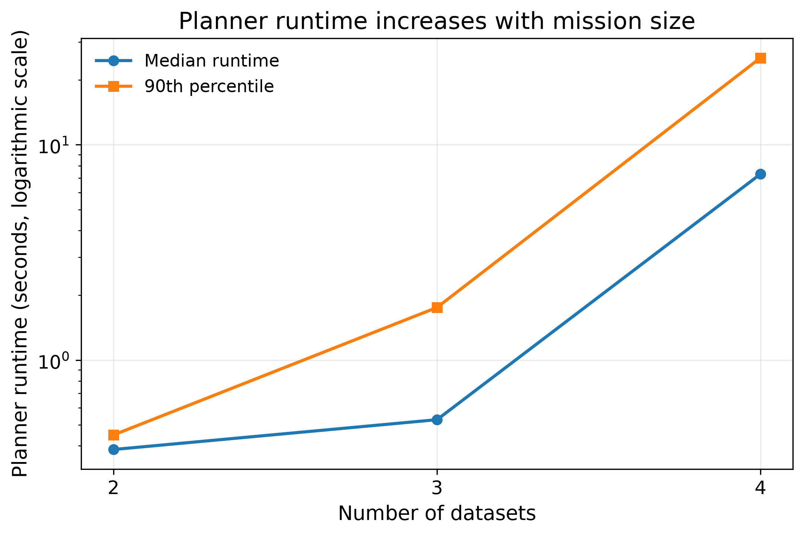
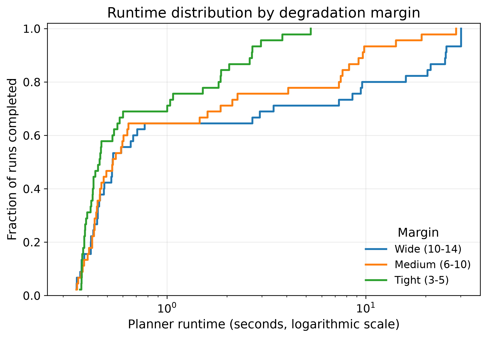
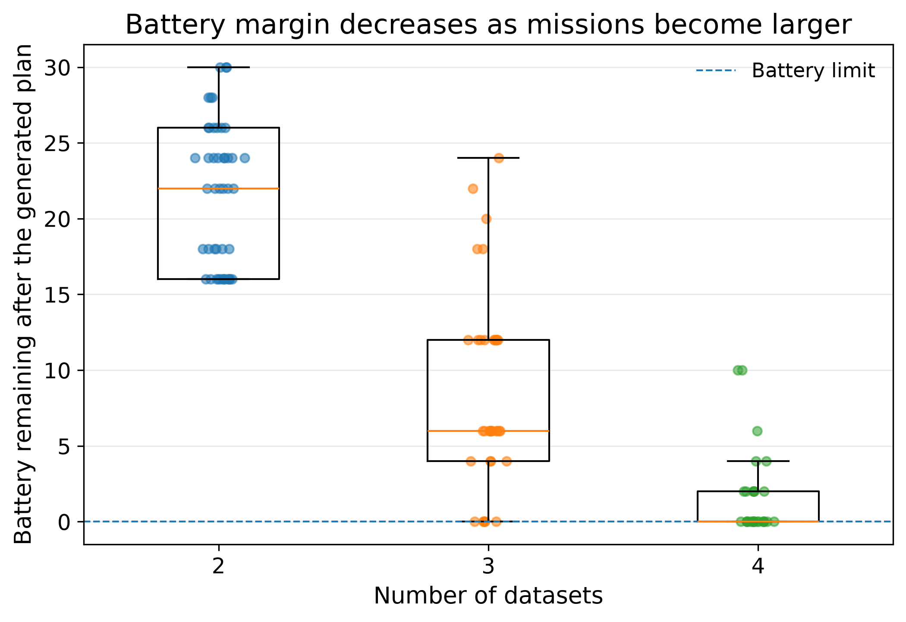

# Battery-Constrained PDDL+ Rover Planning

This repository contains the implementation, experiment data, analysis
notebook, and final paper for a controlled study of rover mission planning
under limited battery, onboard memory, and data-loss deadlines.

The rover moves through seeded terrain, visits science sites, collects and
encodes datasets, carries them in finite memory, and returns them to base
before they become unusable. The planning problem is written in PDDL+ and
solved with ENHSP. A ROS 2 service exposes the same generator and planner used
by the offline experiment.

The study is deliberately small and reproducible. Its purpose is not to claim
that a line-world model behaves like a physical planetary rover. It is to
isolate a clear planning question:

> When mission workload grows, how do memory capacity and degradation
> deadlines affect feasibility, generated plans, and planner runtime under a
> fixed battery budget?

[Read the paper](paper/rover_planning_research_paper.pdf) |
[Open the executed notebook](notebooks/battery_rover_experiment_analysis.ipynb) |
[Inspect the final classified results](experiments/results/battery_final_unseen_classified.csv)

<a id="toc"></a>

<details>
<summary><strong>Table of contents</strong></summary>

1. [System architecture](#system-architecture)
2. [The rover planning model](#1-the-rover-planning-model)
3. [Experimental design](#2-experimental-design)
4. [Planning and validation pipeline](#3-planning-and-validation-pipeline)
5. [Results](#4-results)
6. [Statistical analysis](#5-statistical-analysis)
7. [Repository structure](#repository-structure)
8. [Installation](#installation)
9. [Running the project](#running-the-project)
10. [Important design decisions](#important-design-decisions)
11. [Scope and limitations](#scope-and-limitations)
12. [Paper](#paper)

</details>

---

## System architecture

The repository has one planning pipeline. The command-line experiment, the
analysis notebook, and the ROS 2 demonstration are different ways of using
that pipeline, not separate implementations.

```text
                   experiment configuration
                            +
                         seed value
                             |
                             v
                +---------------------------+
                | deterministic generator   |
                | problem_generator.py      |
                +---------------------------+
                             |
                    PDDL+ problem + metadata
                             |
                             v
                +---------------------------+
                | ENHSP planner             |
                | planner_runner.py         |
                +---------------------------+
                             |
                 plan, status, runtime, log
                             |
                             v
                +---------------------------+
                | independent checks        |
                | route, battery, parsing   |
                +---------------------------+
                             |
                     CSV and JSON results
                             |
                             v
                +---------------------------+
                | executed Jupyter notebook |
                | statistics and figures    |
                +---------------------------+

       ROS 2 service ------ calls the same generator and planner
```

The separation is intentional. Problem generation decides what mission is
being tested. ENHSP decides whether it can produce a plan. Validation checks
the returned route and battery accounting. The notebook analyzes committed
results rather than inventing a second version of the experiment.

[Back to table of contents](#toc)

---

## 1. The rover planning model

### 1.1 Mission layout

The map is a bidirectional line. It contains one base and one science site for
each required dataset. Increasing the dataset count therefore increases both
the amount of science work and the distance to the farthest site.

Each edge receives a terrain class from a seeded generator:

| Terrain | Travel time | Movement energy |
|---|---:|---:|
| Easy | 1.5 | 2 |
| Moderate | 2.0 | 3 |
| Rocky | 2.5 | 4 |
| Steep | 3.0 | 5 |

The battery capacity is fixed at 40 energy units in every final mission.
Movement consumes battery; the current model does not charge energy for
collection, encoding, or offloading.

### 1.2 Why PDDL+ is used

The domain contains decisions, continuous change, and automatic transitions.
PDDL+ represents these with three different mechanisms:

| PDDL+ mechanism | Rover model | Meaning |
|---|---|---|
| Action | `start-move` | A decision selected by the planner |
| Process | `rover-travel` | Continuous travel progress after movement starts |
| Event | `arrive` | An automatic transition when travel completes |

Encoding and degradation can continue while the rover is travelling. This is
the main reason a purely sequential classical-planning model would be a poor
fit for the final study.

### 1.3 Memory and offloading

Collecting a dataset occupies onboard memory. It can be offloaded only at the
base and only after its encoding has completed. Successful offloading releases
that memory.

Memory capacity is calculated from the total volume of the datasets in the
mission:

| Condition | Capacity ratio |
|---|---:|
| Low | 0.45 |
| Medium | 0.70 |
| High | 1.00 |

Capacity is never allowed to be smaller than the largest individual dataset.
Low memory can therefore hold any one dataset, but it may force the rover to
return to base more often instead of collecting several datasets in one trip.
Those extra returns cost both time and battery.

### 1.4 Degradation margin

Once a dataset is collected, it has a finite interval in which it can be
encoded and returned. The manipulated value is the additional time available
after the earliest direct offload:

| Paper term | Margin values | Legacy code label |
|---|---:|---|
| Wide | 10, 12, 14 | `low` corruption |
| Medium | 6, 8, 10 | `medium` corruption |
| Tight | 3, 4, 5 | `high` corruption |

The code retains the field name `corruption_level` because it was used during
development. The paper says *degradation margin* because that is more precise:
the degradation rate stays fixed, while the allowed time window changes.

[Back to table of contents](#toc)

---

## 2. Experimental design

The final study is a complete factorial experiment:

| Factor | Levels |
|---|---|
| Required datasets | 2, 3, 4 |
| Memory | low, medium, high |
| Degradation margin | wide, medium, tight |
| Final seeds | 10, 11, 12, 13, 14 |

This produces:

```text
3 dataset counts x 3 memory levels x 3 margin levels x 5 seeds
= 135 final missions
```

### 2.1 What a seed means here

A seed is a number given to the deterministic mission generator. It controls
the generated dataset properties and terrain choices. The same seed always
recreates the same mission variant.

Seeds are reused across factor levels so that comparisons remain matched. For
example, seed 10 under low and high memory keeps the underlying random mission
variant fixed; the intended memory condition is what changes.

Seeds 0 to 4 were used during model checking and calibration. The experiment
settings were then frozen. Seeds 10 to 14 were reserved for the final unseen
study. Seeds 5 to 9 were not part of the final analysis.

### 2.2 Runtime and final classification

Every standard run received the same 30-second planner limit:

| Status | Standard 30-second run | Final classified data |
|---|---:|---:|
| Solved | 107 | 108 |
| Unsolvable | 25 | 27 |
| Timeout | 3 | 0 |

Only the three unresolved timeouts were rerun with a 120-second limit. One was
solved and two were classified as unsolvable. These longer runs were used only
to determine feasibility. Their runtimes were not inserted into the
fixed-budget runtime analysis.

This distinction matters: a timeout means the planner did not return a result
within the budget. It is not automatically proof that the mission has no plan.

[Back to table of contents](#toc)

---

## 3. Planning and validation pipeline

### 3.1 Problem generation

[`problem_generator.py`](experiments/scripts/problem_generator.py) reads the
frozen battery configuration and creates a PDDL+ problem plus metadata for a
specific factor combination and seed.

Two random streams are derived from the seed. Keeping terrain generation
separate from dataset generation prevents an unrelated change in one part of
the generator from silently changing the other.

### 3.2 Planner execution

[`planner_runner.py`](experiments/scripts/planner_runner.py) runs ENHSP with
the `sat-hadd` configuration, records wall-clock runtime, and parses the
planner status and returned plan.

[`batch_experiment.py`](experiments/scripts/batch_experiment.py) enumerates the
factorial design and writes one row per mission to CSV. Raw planner output is
kept separately from the compact analysis table.

### 3.3 Independent plan checks

The analysis does not trust a plan only because the planner printed
`solved`. The returned movement actions are reconstructed to check:

- that movements follow valid adjacent edges;
- that their terrain-dependent energy costs are correct;
- that total movement energy does not exceed 40;
- that reported remaining battery agrees with the reconstructed value.

### 3.4 Notebook and figure generation

[`battery_rover_experiment_analysis.ipynb`](notebooks/battery_rover_experiment_analysis.ipynb)
is the final executed analysis. It loads the committed results, performs the
statistical tests, exports the tables, and generates every figure used in the
paper.

The notebook contains no error outputs in the committed execution. Its final
cell also calls the ROS 2 service and checks a returned mission independently.
That ROS request is an integration demonstration and is not one of the 135
statistical missions.

[Back to table of contents](#toc)

---

## 4. Results

### 4.1 Mission feasibility



Mission success declined as the number of required datasets increased:

| Required datasets | Successful missions |
|---:|---:|
| 2 | 100% |
| 3 | 80% |
| 4 | 60% |

Memory produced an even stronger overall separation:

| Memory | Successful missions |
|---|---:|
| Low | 46.7% |
| Medium | 93.3% |
| High | 100% |

Wide, medium, and tight degradation-margin conditions each produced 80%
success. This does not mean degradation was absent. Every collected dataset
still had a deadline. It means that, within the tested positive-margin range,
memory and movement energy became the active feasibility bottlenecks first.

### 4.2 The main interaction



The heatmap is the central result of the study:

| Required datasets | Low memory | Medium memory | High memory |
|---:|---:|---:|---:|
| 2 | 100% | 100% | 100% |
| 3 | 40% | 100% | 100% |
| 4 | 0% | 80% | 100% |

Memory appears irrelevant in the smallest missions because all three settings
are sufficient. Its effect emerges only when workload grows. With low memory,
the rover must offload more frequently; the additional travel consumes the
fixed battery budget. High memory avoids many of those forced returns.

### 4.3 Planner runtime



| Required datasets | Median runtime | 90th percentile | Mean runtime |
|---:|---:|---:|---:|
| 2 | 0.384 s | 0.449 s | 0.398 s |
| 3 | 0.528 s | 1.755 s | 0.797 s |
| 4 | 7.315 s | 25.345 s | 9.358 s |

Planning became much harder at four datasets. All three standard timeouts
occurred in that workload. The median is reported alongside the mean because
runtime is strongly skewed.

### 4.4 Runtime by degradation margin



This empirical cumulative distribution function answers a different question
from a bar chart. For any runtime on the horizontal axis, the vertical value
shows the fraction of runs completed by that time. A curve farther to the left
therefore represents generally faster completion.

| Margin | Mean runtime |
|---|---:|
| Wide | 6.253 s |
| Medium | 3.286 s |
| Tight | 1.014 s |

The three conditions had equal feasibility but different search runtimes. A
plausible interpretation is that wider windows leave the planner with more
candidate schedules, while tight windows eliminate alternatives earlier. This
is an interpretation of the observed pattern, not a direct measurement of
ENHSP's internal search decisions.

### 4.5 Battery pressure



| Required datasets | Mean remaining battery in solved missions |
|---:|---:|
| 2 | 21.73 |
| 3 | 8.44 |
| 4 | 1.70 |

Successful four-dataset missions finished close to the 40-unit boundary. This
supports the feasibility result: the largest missions were not simply slower;
they were operating near the energy limit.

### 4.6 Generated-plan efficiency

There were 21 matched mission conditions for which low, medium, and high
memory all produced a plan:

| Metric | Low memory | Medium memory | High memory |
|---|---:|---:|---:|
| Movement actions | 7.71 | 7.14 | 5.33 |
| Movement energy used | 24.57 | 22.86 | 16.38 |
| Plan makespan | 25.76 | 23.52 | 17.10 |

More memory allowed the planner to combine collection work before returning
to base. The resulting plans used fewer moves, less energy, and less time.
These are properties of the generated satisficing plans. ENHSP was not asked
to prove global energy or makespan optimality.

[Back to table of contents](#toc)

---

## 5. Statistical analysis

The same seeds appear across compared factor levels, so the observations are
matched rather than independent. The notebook uses tests that preserve that
structure:

| Analysis question | Method |
|---|---|
| Do three matched feasibility conditions differ? | Cochran's Q |
| Which feasibility pairs differ? | Exact McNemar tests |
| Do three matched numeric conditions differ? | Friedman test |
| How large is the repeated-measure effect? | Kendall's W |
| Which numeric pairs differ? | Wilcoxon signed-rank tests |
| How uncertain is a success rate? | 95% Wilson interval |
| How are follow-up tests corrected? | Holm adjustment |

Selected results from the final analysis:

- dataset count affected matched feasibility:
  `Q(2) = 27.00`, `p = 1.37e-6`;
- memory affected matched feasibility:
  `Q(2) = 42.75`, `p = 5.21e-10`;
- degradation margin did not change matched feasibility:
  `Q(2) = 0`, `p = 1`;
- dataset count had a strong matched runtime effect:
  `W = 0.958`;
- degradation margin had a moderate matched runtime effect:
  `W = 0.400`;
- memory had strong matched effects on movement count, energy, and makespan:
  `W = 0.815` to `0.840`.

The Wilson interval is not another rover parameter. It is the uncertainty
interval drawn around an observed success percentage. Kendall's W is also not
a mission value; it summarizes the strength of a matched statistical effect
from 0 to 1.

There are only five seeded variants in each experimental cell. The tests are
therefore evidence about this controlled domain, not universal estimates of
real planetary-rover performance.

All exported statistical tables are in
[`experiments/results/tables/battery_final/`](experiments/results/tables/battery_final/).

[Back to table of contents](#toc)

---

## Repository structure

```text
planetary-rover-experimental-study/
├── experiments/
│   ├── config/
│   │   └── experiment_config_battery.json
│   ├── generated_problems/          generated PDDL+ instances
│   ├── raw_outputs/                 raw ENHSP output
│   ├── scripts/
│   │   ├── problem_generator.py
│   │   ├── planner_runner.py
│   │   └── batch_experiment.py
│   ├── results/
│   │   ├── battery_final_unseen.csv
│   │   ├── battery_final_unseen_classified.csv
│   │   └── tables/battery_final/
│   └── plots/battery_final/         the five paper figures
├── notebooks/
│   └── battery_rover_experiment_analysis.ipynb
├── planning_models/
│   ├── classical/                   early baseline models
│   └── pddl_plus/
│       └── domain-memory-rover-battery.pddl
├── ros2_ws/src/
│   ├── rover_experiment_interfaces/
│   └── rover_experiment_ros/
├── paper/
│   └── rover_planning_research_paper.pdf
└── README.md
```

The final paper is committed as a PDF. LaTeX source is not required to read or
reproduce the computational study.

[Back to table of contents](#toc)

---

## Installation

The project was developed on Ubuntu 24.04 / WSL with:

- Python 3.12;
- Java;
- ENHSP;
- ROS 2 Jazzy;
- JupyterLab.

Create the Python environment from the repository root:

```bash
python3 -m venv .venv
source .venv/bin/activate
python3 -m pip install --upgrade pip
python3 -m pip install \
  jupyterlab pandas numpy matplotlib scipy nbformat setuptools
```

ENHSP must be available to the runner before regenerating plans. It is not
needed if the goal is only to inspect the committed notebook, tables, figures,
or paper.

[Back to table of contents](#toc)

---

## Running the project

### Generate one reproducible mission

```bash
python3 experiments/scripts/problem_generator.py \
  --model battery \
  --datasets 3 \
  --memory medium \
  --corruption medium \
  --seed 10 \
  --config experiments/config/experiment_config_battery.json \
  --output-dir experiments/generated_problems/example_battery_run
```

Here, `--corruption medium` selects the medium degradation-margin condition.
The older option name is retained for code compatibility.

### Run the final factorial design

```bash
python3 experiments/scripts/batch_experiment.py \
  --model battery \
  --config experiments/config/experiment_config_battery.json \
  --runs-per-condition 5 \
  --seed-start 10 \
  --planner sat-hadd \
  --timeout 30 \
  --generated-dir experiments/generated_problems/battery_final_unseen \
  --raw-output-dir experiments/raw_outputs/battery_final_unseen \
  --results experiments/results/battery_final_unseen.csv
```

The committed final results can be analyzed without rerunning ENHSP.

### Execute the notebook

Start JupyterLab from the repository root:

```bash
source .venv/bin/activate
jupyter lab
```

Open
[`notebooks/battery_rover_experiment_analysis.ipynb`](notebooks/battery_rover_experiment_analysis.ipynb)
and use **Kernel > Restart Kernel and Run All Cells**.

The statistical figures are generated by the notebook and saved to
`experiments/plots/battery_final/`.

### Run the ROS 2 integration check

Build the workspace once:

```bash
cd ros2_ws
source /opt/ros/jazzy/setup.bash
colcon build --symlink-install
source install/setup.bash
cd ..
```

Start the service from the repository root:

```bash
source /opt/ros/jazzy/setup.bash
source ros2_ws/install/setup.bash
export ROVER_PROJECT_ROOT="$PWD"
ros2 run rover_experiment_ros experiment_service
```

Keep that terminal running. In a second terminal, launch JupyterLab and run the
final notebook cell. A correct response reports a solved mission and passes
the route and battery assertions.

[Back to table of contents](#toc)

---

## Important design decisions

| Decision | Reason |
|---|---|
| Use PDDL+ for the final domain | Travel, encoding, and degradation evolve over time |
| Keep battery fixed at 40 | Makes workload, memory, and margin comparisons interpretable |
| Reuse seeds across conditions | Preserves matched mission variants |
| Separate calibration and final seeds | Avoids tuning the model on final reported instances |
| Use a common 30-second limit | Makes planner runtime outcomes comparable |
| Reclassify only unresolved timeouts | Separates feasibility from the fixed runtime study |
| Validate route and battery independently | Catches parsing or accounting errors after planning |
| Use matched statistical tests | Reflects the repeated-seed experimental design |
| Keep ROS outside the 135 runs | Demonstrates integration without changing the sample |
| Report satisficing plans honestly | ENHSP does not guarantee global optimum here |

[Back to table of contents](#toc)

---

## Scope and limitations

- The terrain is synthetic and the map is a bidirectional line.
- Increasing dataset count also extends the map, so workload and spatial
  extent are not separated.
- Degradation is deterministic rather than probabilistic.
- Only movement consumes battery in the current model.
- One ENHSP search configuration, `sat-hadd`, was evaluated.
- Wall-clock runtime includes Java and planner startup overhead.
- Each experimental cell contains five final seeded variants.
- Returned plans are satisficing, not guaranteed global optima.
- The ROS 2 component demonstrates software integration, not physical rover
  control.

The appropriate conclusion is narrow: the tested domain contains a region in
which memory and workload strongly affect feasibility and plan efficiency,
while the tested positive degradation margins change search runtime more than
success. Broader claims require richer maps, more seeds, additional planners,
and a more complete energy model.

[Back to table of contents](#toc)

---

## Paper

The final five-page report contains the formal study description, hypotheses,
methods, figures, and interpretation:

**[Battery-Constrained PDDL+ Rover Planning: Effects of Memory, Workload, and Data Degradation](paper/rover_planning_research_paper.pdf)**

Author: **Endri Gjinaj**  
Robotics Engineering, University of Genoa

[Back to table of contents](#toc)
