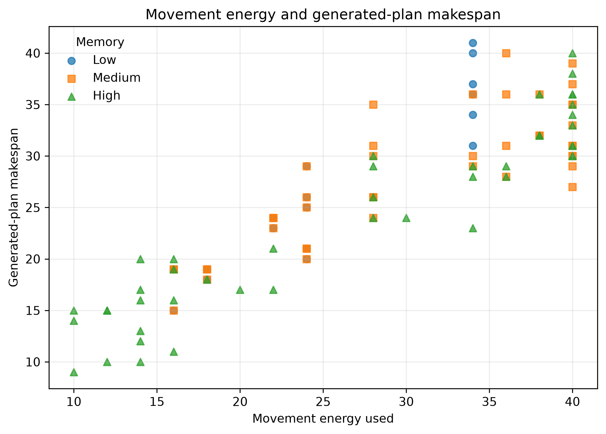

# Battery-Constrained Planetary Rover Planning

A reproducible PDDL+ study of a planetary rover operating under a fixed battery budget, limited onboard memory, terrain-dependent travel costs, and scientific data that degrades over time.

**How do onboard memory, mission size, and time-dependent data degradation affect the feasibility, efficiency, and planning difficulty of a battery-constrained rover mission?**

The project ties together a PDDL+ domain, a deterministic mission generator, automated ENHSP execution, a 135-instance final experiment with full statistical analysis, a ROS 2 service/client, and an IEEE-style paper — all reproducible from this repo.

---

## Contents

- [Overview](#overview)
- [Mission model](#mission-model)
- [Experimental design](#experimental-design)
- [Main results](#main-results)
- [Statistical summary](#statistical-summary)
- [Repository structure](#repository-structure)
- [Requirements](#requirements)
- [Quickstart](#quickstart)
- [ROS 2 interface](#ros-2-interface)
- [Paper](#paper)
- [Reproducibility](#reproducibility)
- [Limitations](#limitations)
- [Citation](#citation)
- [License](#license)
- [Author](#author)

---

## Overview

The rover travels from a base station to a sequence of science sites, collecting and encoding datasets along the way. Collected data occupies onboard memory and must be returned to base before its corruption reaches a loss threshold — so the planner has to reason jointly about energy, memory, and time.

The final model includes:

- timed bidirectional movement across four terrain profiles (different travel times and energy costs)
- continuous encoding progress and continuous data corruption
- limited onboard memory and a fixed 40-unit battery
- collection, movement, arrival, encoding-completion, data-loss, and offload events
- validation of route metrics and battery use

## Mission model

Movement is represented by an action, a continuous process, and an arrival event:

```
start-move action
        |
        v
rover-travel process
        |
        v
arrive event
```

Battery is consumed only by movement. Encoding and corruption continue while the rover is travelling.

## Experimental design

The model was developed and checked on seeds `0-4`. After the configuration was frozen, the final experiment ran on unseen seeds `10-14`.

| Factor                 | Values                                   |
| ----------------------- | ----------------------------------------- |
| Dataset count           | 2, 3, 4                                   |
| Memory level            | low, medium, high                         |
| Memory ratio            | 0.45, 0.70, 1.00                          |
| Degradation margin      | wide (10-14), medium (6-10), tight (3-5)  |
| Final seeds             | 10, 11, 12, 13, 14                        |
| Battery capacity        | 40 energy units                           |
| Terrain profiles        | easy, moderate, rocky, steep               |
| Planner                 | ENHSP `sat-hadd`                          |
| Standard timeout        | 30 seconds                                |
| Classification timeout  | 120 seconds                               |
| Final instances         | 135                                       |

```
3 dataset counts × 3 memory levels × 3 degradation-margin conditions × 5 final seeds = 135 missions
```

**Timeout handling.** The original 30-second runs are kept for runtime analysis. Only the three timeout cases were rerun with a 120-second limit to get a final solved/unsolvable label. A timeout is never treated as evidence that a mission is unsolvable.

| Outcome    | Standard 30 s run | Final classification |
| ---------- | ------------------ | ---------------------- |
| Solved     | 107                 | 108                     |
| Unsolvable | 25                  | 27                      |
| Timeout    | 3                   | 0                       |

## Main results

### Mission success by factor


Success dropped sharply as workload increased:

| Dataset count | Solved | Unsolvable | Success rate |
| -------------- | ------ | ----------- | ------------- |
| 2              | 45     | 0           | 100%          |
| 3              | 36     | 9           | 80%           |
| 4              | 27     | 18          | 60%           |

Memory showed the strongest feasibility effect:

| Memory level | Solved | Unsolvable | Success rate |
| ------------- | ------ | ----------- | ------------- |
| Low           | 21     | 24          | 46.7%         |
| Medium        | 42     | 3           | 93.3%         |
| High          | 45     | 0           | 100%          |

All three degradation-margin conditions produced an 80% success rate over the tested ranges — corruption evolved in every collected dataset, but the tested change in temporal slack didn't move the final solved count.

### Interaction between mission size and memory


| Mission size | Low memory | Medium memory | High memory |
| ------------- | ---------- | --------------- | ------------- |
| 2 datasets    | 100%       | 100%            | 100%          |
| 3 datasets    | 40%        | 100%            | 100%          |
| 4 datasets    | 0%         | 80%             | 100%          |

Small missions don't reveal a storage bottleneck at all. As dataset count grows, limited memory forces extra return trips to base, driving up both energy use and exposure to data degradation.

### Planner runtime


| Dataset count | Median runtime | 90th percentile | Mean runtime |
| -------------- | --------------- | ----------------- | -------------- |
| 2              | 0.384 s         | 0.449 s            | 0.398 s        |
| 3              | 0.528 s         | 1.755 s            | 0.797 s        |
| 4              | 7.315 s         | 25.345 s           | 9.358 s        |

The jump from three to four datasets is substantial; all three standard timeouts occurred in four-dataset missions.

### Battery margin


Among solved missions, average remaining battery fell from 21.73 units (2 datasets) to 8.44 units (3) to 1.70 units (4) — the largest solved missions operate close to the 40-unit limit.

### Movement energy and makespan



Plans that use more movement energy generally also have a longer makespan, since both scale with travel. The planner is satisficing, so these values describe the generated plans, not guaranteed global optima.

## Statistical summary

The notebook reports exploratory tests and effect sizes:

- dataset count was associated with feasibility (Cramer's V = 0.408)
- memory level had the strongest feasibility association (Cramer's V = 0.593)
- degradation margin showed no feasibility association in the final sample
- dataset count had a large effect on standard planner runtime (epsilon-squared = 0.750)
- matched missions showed large memory effects on movement, energy use, and makespan

Full tables: `experiments/results/tables/battery_final/`

## Repository structure

```
planetary-rover-experimental-study/
├── experiments/
│   ├── config/
│   ├── scripts/
│   ├── results/
│   └── plots/
├── notebooks/
│   └── battery_rover_experiment_analysis.ipynb
├── paper/
│   ├── references.bib
│   ├── rover_planning_research_paper.tex
│   ├── rover_planning_research_paper.pdf
│   └── build_paper.sh
├── planning_models/
│   └── pddl_plus/
├── ros2_ws/
│   └── src/
└── README.md
```

Key files:

```
planning_models/pddl_plus/domain-memory-rover-battery.pddl
experiments/config/experiment_config_battery.json
experiments/scripts/problem_generator.py
experiments/scripts/planner_runner.py
experiments/scripts/batch_experiment.py
experiments/results/battery_final_unseen.csv
experiments/results/battery_final_unseen_classified.csv
notebooks/battery_rover_experiment_analysis.ipynb
paper/rover_planning_research_paper.tex
paper/references.bib
paper/rover_planning_research_paper.pdf
```

## Requirements

- Ubuntu 24.04 or WSL
- Python 3.12
- Java
- [ENHSP](https://sites.google.com/view/enhsp/)
- ROS 2 Jazzy
- JupyterLab
- LaTeX with `latexmk` and the `IEEEtran` class (`texlive-publishers` on Ubuntu)

```bash
python3 -m venv .venv
source .venv/bin/activate
python3 -m pip install --upgrade pip
python3 -m pip install jupyterlab pandas numpy matplotlib scipy nbformat setuptools
```

## Quickstart

**1. Generate one mission**

```bash
python3 experiments/scripts/problem_generator.py \
  --model battery \
  --datasets 3 \
  --memory medium \
  --corruption medium \
  --seed 10 \
  --config experiments/config/experiment_config_battery.json \
  --output-dir experiments/generated_problems/example_battery_run
```

**2. Run ENHSP on it**

```bash
python3 experiments/scripts/planner_runner.py \
  --domain planning_models/pddl_plus/domain-memory-rover-battery.pddl \
  --problem experiments/generated_problems/example_battery_run/rover-battery-n3-mem-medium-corr-medium-seed-10.pddl \
  --output experiments/raw_outputs/example_battery_run.txt \
  --planner sat-hadd \
  --timeout 30
```

**3. Reproduce the full 135-instance batch**

```bash
python3 experiments/scripts/batch_experiment.py \
  --model battery \
  --config experiments/config/experiment_config_battery.json \
  --runs-per-condition 5 \
  --seed-start 10 \
  --planner sat-hadd \
  --timeout 30 \
  --generated-dir experiments/generated_problems/battery_final_unseen \
  --raw-output-dir experiments/raw_outputs/battery_final_unseen \
  --results experiments/results/battery_final_unseen.csv
```

**4. Run the analysis notebook**

The notebook validates the final data, regenerates the five main figures, runs the statistical tests, exports the result tables, and issues one live ROS 2 request — so start the ROS 2 service first.

```bash
# terminal 1 — ROS 2 service
source /opt/ros/jazzy/setup.bash
source ros2_ws/install/setup.bash
export ROVER_PROJECT_ROOT="$PWD"
ros2 run rover_experiment_ros experiment_service

# terminal 2 — JupyterLab
source .venv/bin/activate
jupyter lab
# open notebooks/battery_rover_experiment_analysis.ipynb
# Kernel -> Restart Kernel and Run All Cells
```

## ROS 2 interface

Build the workspace:

```bash
cd ros2_ws
source /opt/ros/jazzy/setup.bash
colcon build --symlink-install
source install/setup.bash
cd ..
```

Run the service (same as above), then send a request from a second terminal:

```bash
source /opt/ros/jazzy/setup.bash
source ros2_ws/install/setup.bash

ros2 run rover_experiment_ros experiment_client \
  --datasets 3 \
  --memory medium \
  --corruption medium \
  --seed 0 \
  --timeout 30
```

The response includes planner status, runtime, makespan, action counts, battery capacity, energy used, battery remaining, and battery feasibility.

## Paper

The final IEEE-style paper is at `paper/rover_planning_research_paper.pdf`. Build it from source:

```bash
cd paper
./build_paper.sh
```

## Reproducibility

Mission generation is deterministic for a given dataset count, memory level, degradation-margin condition, seed, and configuration. The implementation keeps the original `corruption_level` field and `--corruption` command-line flag. Dataset properties, terrain, and corruption margins each use separate deterministic random streams, so changing one factor doesn't regenerate unrelated mission properties.

The frozen final model is tagged `battery-model-frozen-v1`.

## Limitations

- The terrain map is a bidirectional line.
- Missions and terrain are synthetic.
- Data degradation is deterministic.
- Battery is consumed only by movement.
- One rover, one base, and one planner configuration are studied.
- Five unseen seeds are used per condition.
- Planner runtime includes Java and startup overhead.
- Generated plans are satisficing, not guaranteed optimal.
- The project does not control a physical rover.

## Citation

If this work is useful to you, please cite:

```bibtex
@misc{gjinaj_battery_rover,
  author = {Gjinaj, Endri},
  title  = {Battery-Constrained Planetary Rover Planning},
  year   = {2026},
  url    = {https://github.com/egjinaj/planetary-rover-experimental-study}
}
```

## License

<!-- Add your license (e.g. MIT) and drop a LICENSE file in the repo root; update this section to match. -->

## Author

Endri Gjinaj
Master's Degree in Robotics Engineering
University of Genoa
